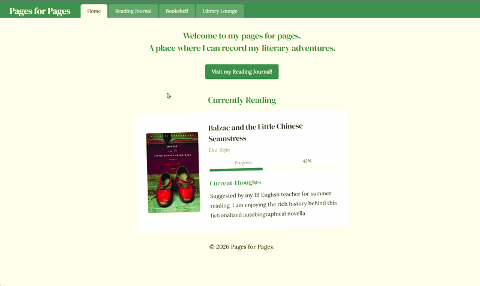

# Pages for Pages


My reading journal, now reimagined as a digital space that showcases my reading endeavors through an interactive log, a custom visual bookshelf, and a simple workspace designed to elevate the reading and annotation experience.

 

Quick Start:

[](https://reuthecoder.github.io/pages-for-pages/) 

## Site Features
- **Interactive Reading Journal:** This is the core of the site. It is a book log that includes title search functionality and touch-swipe navigation support.
- **Visual Bookshelf:** A digital bookcase frame that displays individual display and book spine slots that dynamically reveal full book artwork upon hover.
- **Styled Content Cards:** Multiple pages feature content cards that display extra information such as a recommended book or what I am currently reading and how much progress I have made.
- **Integrated Focus Timer:** A geometric Pomodoro system featuring custom interval steppers and a circular SVG countdown tracking arc.
- **Ambient Soundscape Mixer:** A three-channel volume slider deck configured to play rain, fire, and conversational background tracks simultaneously.
- **Embedded Media Console:** A URL parser that automatically turns Youtube URLs into looping background videos
- **Scratchpad:** An auto-saving local textarea module that caches written text directly to the browser storage.


## How It Works

I built this site entirely with HTML5, CSS3, and Vanilla JavaScript  because I wanted it to feel lightweight, handmade, and to make the project a real learning experience. Avoiding frameworks meant more debugging, but it helped me understand how the browser actually works.

The reading log runs on a small state controller I wrote myself. It handles swiping, title searches, and page transitions using simple `translateX` transforms, which keep animations smooth and fast. Passive touch listeners (`touchstart` and `touchend`) make swipe navigation feel natural on mobile without slowing down rendering.

The media console was the hardest part. With some AI help, I wrote a tiny regex that extracts the 11‑character YouTube video ID from any link and turns it into a looping iframe. I originally considered using a library, but it felt too heavy for what I wanted and I found that building my own parser ended up being simpler and more fun.

Mobile layout consistency comes from the Flexbox layout model and horizontal scrolling (`overflow-x: auto`). I applied the same idea to the CSS bookshelf so my TBR list was not limited by the shelf’s physical layout. I spent a lot of time tweaking this because I wanted menus to glide sideways instead of collapsing into awkward stacks. Features like dark mode and scratchpad notes are saved with `localStorage`, which keeps the site feeling personal without needing a backend. Building everything this way taught me a lot about writing small, clean JavaScript features and relying on the browser’s own tools instead of external dependencies. It made the project feel intentional, and I’m proud of how much I learned.
## How to Run Locally

This site has no system dependencies, requires no runtime installation commands (like npm or yarn), and uses browser `localStorage` instead of external environment variables.

1. **Clone the repository:**
   ```bash
   git clone https://github.com/ReuTheCoder/pages-for-pages.git
   ```
2. **Open the project folder:**
   ```bash
   cd pages-for-pages
   ```
3. **Launch the site:**
- Double-click the `index.html` file in your file explorer to open it in any modern web browser. 
**OR** 
- Using VS Code, open the project and click **Go Live** via the Live Server extension to run a local development server at `http://127.0.0.1:5500`.

## Acknowledgements
This project was made as a submission to [HackClub's Stardance Challenge](https://stardance.hackclub.com/) and was inspired when brainstorming ideas for their Personal Site mission. Thank you to Hackclub for motivating me to make this project!

Many of *Library Lounge*’s features were inspired by [I Miss My Cafe](https://imissmycafe.com). The media player was inspired by [LifeAt](https://lifeat.io). 

Codynn’s [Build a Pomodoro App](https://www.youtube.com/watch?v=LyT055nXXyc) project tutorial provided much help when making the Pomodoro Timer function for the *Library Lounge*.

"favicon.io" was used for making the favicon. The image was sourced from *All Day April* through Canva and slightly edited to better match the site's color palette. "ezgif.com" was used for the attached gif. Any audio was taken from Pixabay and was confirmed to not require attribution for non-commercial products.

### AI Use

I tried my best to avoid AI whenever possible. When debugging, I attempted to solve an issue first before consulting AI. Instead of asking AI to build entire sections of my project, I only used it to clarify specific syntax questions and then worked through the implementation on my own. 

Google’s Gemini was both purposely and inadvertently used during the creation of this project. It provided some assistance when researching how to implement a feature, solidifying the website color palette and drafting the initial structure of my CSS and Javascript to help achieve my desired look. It was intentionally used to aid in the creation of the embedded media console, the JS for the volume sliders and confirming I properly implemented `localStorage` to the annotation scratchpad.

OpenAI’s ChatGPT was used for debugging. 
